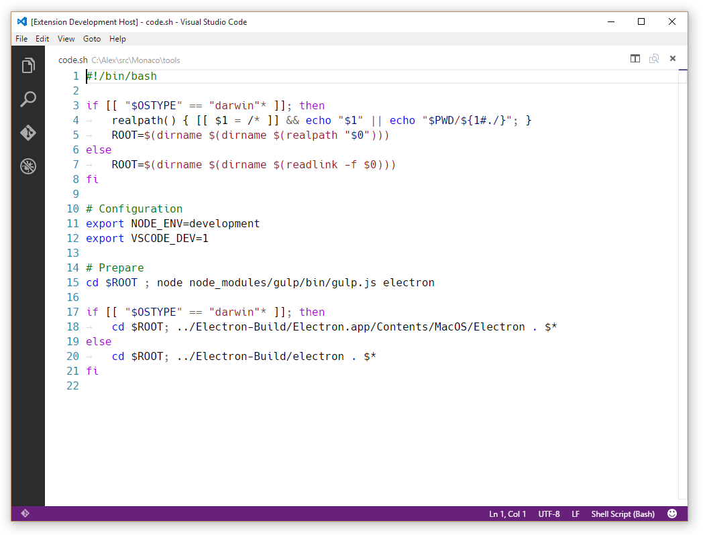
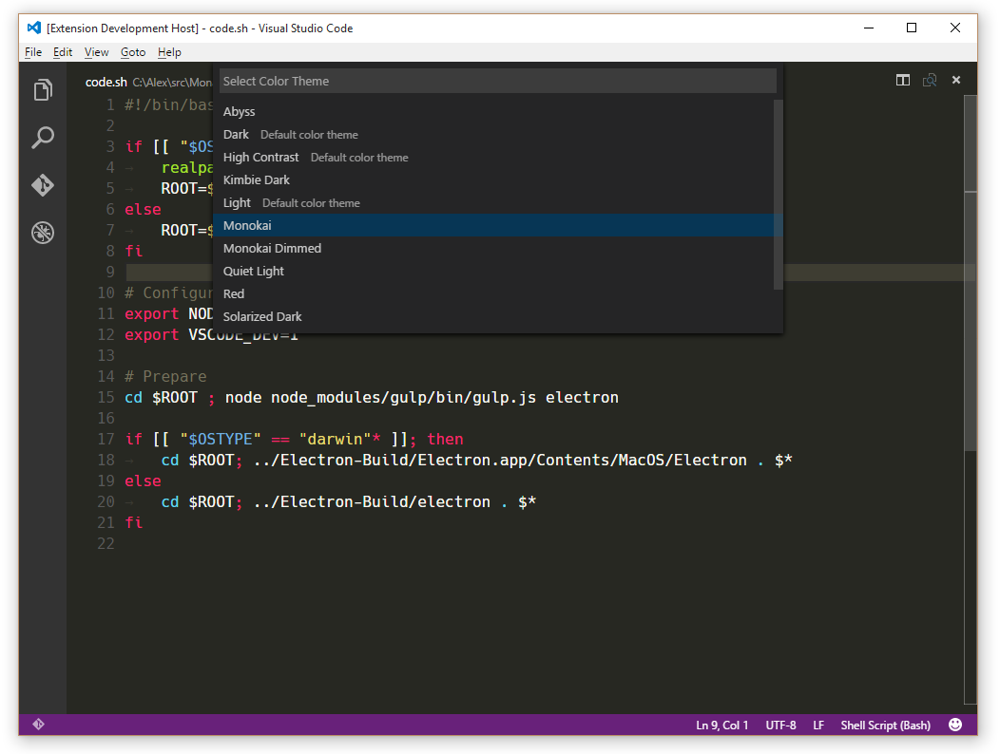

# Contribution Points - package.json

这篇文档包含了[`package.json` extension manifest](/docs/extensionAPI/extension-manifest.md)中 `contribution` 选项的所有可用字段。

* [`configuration`](/docs/extensionAPI/extension-points.md#contributesconfiguration)
* [`commands`](/docs/extensionAPI/extension-points.md#contributescommands)
* [`keybindings`](/docs/extensionAPI/extension-points.md#contributeskeybindings)
* [`languages`](/docs/extensionAPI/extension-points.md#contributeslanguages)
* [`debuggers`](/docs/extensionAPI/extension-points.md#contributesdebuggers)
* [`grammars`](/docs/extensionAPI/extension-points.md#contributesgrammars)
* [`themes`](/docs/extensionAPI/extension-points.md#contributesthemes)
* [`snippets`](/docs/extensionAPI/extension-points.md#contributessnippets)
* [`jsonValidation`](/docs/extensionAPI/extension-points.md#contributesjsonvalidation)

## `contributes.configuration`

`contributes.configuration` 选项会被暴露给用户。用户能够在“用户设置”或“工作区设置”面板中设置这些配置选项。
在配置 `contributes.configuration` 时，同时也配置了这些JSON选项的定义模式。这确保了用户在设置VS Code 配置文件时能获得更好的工具支持。
你能够通过 `vscode.workspace.getConfiguration('myExtension')` 来获取你编写的拓展的配置。

### 例子

```json
// package.json
...
"contributes": {
	"configuration": {
		"type": "object",
		"title": "TypeScript configuration",
		"properties": {
			"typescript.useCodeSnippetsOnMethodSuggest": {
				"type": "boolean",
				"default": false,
				"description": "Complete functions with their parameter signature."
			},
			"typescript.tsdk": {
				"type": ["string", "null"],
				"default": null,
				"description": "Specifies the folder path containing the tsserver and lib*.d.ts files to use."
			}
		}
	}
}
```


## `contributes.configurationDefaults`

设置默认语言特定的编辑器配置。这将覆盖所提供语言的默认编辑器配置。
下面的例子提供了 `markdown` 语言的默认编辑器配置

### 例子

```json
// package.json
"contributes": {
    "configurationDefaults": {
        "[markdown]": {
            "editor.wordWrap": "on",
            "editor.quickSuggestions": false
        }
    }
}
```

## `contributes.commands`

提供了一个由 commands 和 title 组成的条目，用于在 **命令面板**(⇧⌘P) 中调用

>**Note:** 当一个命令被调用的时候（无论是通过按键绑定还是命令面板），VS Code 将触发一个 activationEvent `onCommand:${command}`。

### Example

```json
...
"contributes": {
	"commands": [{
		"command": "extension.sayHello",
		"title": "Hello World"
	}]
}
...
```


## `contributes.menus`

将一个命令的菜单项提供给编辑器或者资源管理器。菜单项定义了选择时应该调用的命令以及项目应该显示的条件。后者使用 `when` 子句，并结合子句上下文通过按键绑定来定义的。 除了必要的 command 属性，我们还可以使用 `alt` 来替换。当鼠标悬浮在菜单项上时，按住 Alt 可以显示和调用。最后，`group` 属性定义了菜单项的分组与排序。 Last, a group-property defines sorting and grouping of menu items. `navigation` 组是比较特殊的，因为它总是会排在菜单栏的顶部/开始处。

目前拓展的开发者能够修改这些部分：

- 全局的命令面板 - `commandPalette`
- 资源管理器环境菜单 - `explorer/context`
- 编辑器环境菜单 - `editor/context`
- 编辑器的标题菜单栏 - `editor/title`
- 编辑器标题的上下文菜单 - `editor/title/context`
- 调试调用堆栈的上下文菜单 - `debug/callstack/context`
- [SCM 标题菜单](https://code.visualstudio.com/docs/extensionAPI/api-scm#_menus) - `scm/title`
- [SCM 资源组菜单](https://code.visualstudio.com/docs/extensionAPI/extension-points#_contributessnippets) - `scm/resourceGroup/context`
- [SCM 资源菜单](https://code.visualstudio.com/docs/extensionAPI/api-scm#_menus) - `scm/resource/context`
- [SCM 修改标题时的菜单](https://code.visualstudio.com/docs/extensionAPI/api-scm#_menus) - `scm/change/title`
- [View 面板标题菜单](https://code.visualstudio.com/docs/extensionAPI/extension-points#_contributesviews) - `view/title`
- [View 面板中项目的菜单](https://code.visualstudio.com/docs/extensionAPI/extension-points#_contributesviews) - `view/item/context`

>**Note:** 当一个命令通过 （上下文）菜单调用时，VS Code 会尝试推断出当前选定的资源，并以参数的形式传递给被调用的命令

除了标题之外，命令还可以定义 VS Code在编辑器标题菜单栏中使用的的图标。

### 例子

```json
"contributes": {
    "menus": {
        "editor/title": [{
            "when": "resourceLangId == markdown",
            "command": "markdown.showPreview",
            "alt": "markdown.showPreviewToSide",
            "group": "navigation"
        }]
    }
}
```


### 命令面板中的命令可见性

当我们在 `package.json` 中定义命令的时候，它们就会自动显示在命令面板中(`⇧⌘P`)，为了更好地控制命令的可见性，这里有一个 `commandPalette` 的菜单选项。它允许你定义一个when条件来控制命令是否应该在 **命令面板** 中可。

下面的代码片段使得 `Hello World` 命令只有当用户在编辑器中选择了某些东西的时候才会显示出来。

```json
"commands": [{
    "command": "extension.sayHello",
    "title": "Hello World"
}],
"menus": {
    "commandPalette": [{
        "command": "extension.sayHello",
        "when": "editorHasSelection"
    }]
}
```

### 组排序

菜单项可以被分成组。它们按照以下默认值/规则按字典顺序排序。

编辑器的上下文菜单具有以下默认值：

- navigation - `navigation` 组无论何时都会被排在第一位。
- 1_modification - 接下来的这个组包含来修改你代码的一些命令
- 9_cutcopypaste - 最后这个组包含了最基本的编辑命令


您可以将菜单项添加到这些组中，或者在这些组中间、下面或者上面添加新的菜单项组。只有编辑器上下文菜单允许这个分组控制。

### 组内排序

组内的顺序取决于标题或顺序属性。菜单项的组内顺序通过将 `@<number>` 附加到组标识符指定，如下所示：


```json
"editor/title": [{
    "when": "editorHasSelection",
    "command": "extension.Command",
    "group": "myGroup@1"
}]
```

## `contributes.keybindings`

Contribute a key binding rule defining what command should be invoked when the user presses a key combination. See the [Key Bindings](/docs/customization/keybindings.md) topic where key bindings are explained in detail.

Contributing a key binding will cause the Default Keyboard Shortcuts to display your rule, and every UI representation of the command will now show the key binding you have added. And, of course, when the user presses the key combination the command will be invoked.

>**Note:** Because VS Code runs on Windows, Mac and Linux, where modifiers differ, you can use "key" to set the default key combination and overwrite it with a specific platform.

>**Note:** When a command is invoked (from a key binding or from the Command Palette), VS Code will emit an activationEvent `onCommand:${command}`.

### Example

Defining that `kbstyle(Ctrl+F1)` under Windows and Linux and `kbstyle(Cmd+F1)` under Mac trigger the `"extension.sayHello"` command:

```json
...
"contributes": {
	"keybindings": [{
		"command": "extension.sayHello",
		"key": "ctrl+f1",
		"mac": "cmd+f1",
		"when": "editorTextFocus"
	}]
}
...
```


## `contributes.languages`

Contribute the definition of a language. This will introduce a new language or enrich the knowledge VS Code has about a language.

In this context, a language is basically a string identifier that is associated to a file (See `TextDocument.getLanguageId()`).

VS Code uses three hints to determine the language a file will be associated with. Each "hint" can be enriched independently:
1. the extension of the filename (`extensions` below)
2. the filename (`filenames` below)
3. the first line inside the file (`firstLine` below)

The last piece of information VS Code wants to know about a language is the `aliases` property, the first item in this list will be picked as the language label (as rendered in the status bar on the right).

When a file is opened by the user, these three rules are applied and a language is determined. VS Code will then emit an activationEvent `onLanguage:${language}` (e.g. `onLanguage:python` for the example below)

### Example

```json
...
"contributes": {
	"languages": [{
		"id": "python",
		"extensions": [ ".py" ],
		"aliases": [ "Python", "py" ],
		"filenames": [ ... ],
		"firstLine": "^#!/.*\\bpython[0-9.-]*\\b"
	}]
}
```
## `contributes.debuggers`

Contribute a 'debug adapter' to VS Code's debugger. A debug adapter integrates VS Code with a particular debug engine.
It runs in a separate process and communicates with VS Code through the VS Code debug protocol.
You must provide one (or more) executables that implement the debug adapter.

### Example

```json
...
"contributes": {
	"debuggers": [{
		"type": "node",
		"label": "Node Debug",
		"program": "./out/node/nodeDebug.js",
		"runtime": "node",
		"enableBreakpointsFor": { "languageIds": ["javascript", "javascriptreact"] },
		"initialConfigurations": [{
			...
		}],
		"configurationAttributes": {
			...
		}
	}]
}
...
```

For a full walkthrough on how to integrate a `debugger` go to [Debuggers](/docs/extensions/example-debuggers.md).

## `contributes.grammars`

Contribute a TextMate grammar to a language. You must provide the `language` this grammar applies to, the TextMate `scopeName` for the grammar and the file path.

>**Note:** The file containing the grammar can be in JSON (filenames ending in .json) or in XML plist format (all other files).

### Example

```json
...
"contributes": {
	"grammars": [{
		"language": "shellscript",
		"scopeName": "source.shell",
		"path": "./syntaxes/Shell-Unix-Bash.tmLanguage"
	}]
}
...
```

See [Adding Language Colorization](/docs/customization/colorizer.md) for instructions on using the [yo code extension generator](/docs/tools/yocode.md) to quickly package TextMate .tmLanguage files as VS Code extensions.



## `contributes.themes`

Contribute a TextMate theme to VS Code. You must specify a label, whether the theme is a dark theme or a light theme (such that the rest of VS Code changes to match your theme) and the path to the file (XML plist format).

### Example

```json
"contributes": {
	"themes": [{
		"label": "Monokai",
		"uiTheme": "vs-dark",
		"path": "./themes/Monokai.tmTheme"
	}]
}
```



See [Changing the Color Theme](/docs/customization/themes.md) for instructions on using the [yo code extension generator](/docs/tools/yocode.md) to quickly package TextMate .tmTheme files as VS Code extensions.

## `contributes.snippets`

```json
"contributes": {
	"snippets": [{
		"language": "go",
		"path": "./snippets/go.json"
	}]
}
```

## `contributes.jsonValidation`

Contributes a validation schema for a specific type of `json` file.  The `url` value can be either a local path to a schema file included in the extension or a remote server URL such as a [json schema store](http://schemastore.org/json).

```json
"contributes": {
    "jsonValidation": [{
 		"fileMatch": ".jshintrc",
 		"url": "http://json.schemastore.org/jshintrc"
	}]
}
```

## Next Steps
To learn more about VS Code extensibility model, try these topic:

* [Extension Manifest File](/docs/extensionAPI/extension-manifest.md) - VS Code package.json extension manifest file reference
* [Activation Events](/docs/extensionAPI/activation-events.md) - VS Code activation events reference

## Common Questions

Nothing yet


