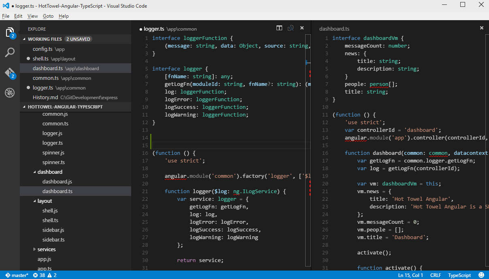
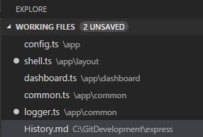
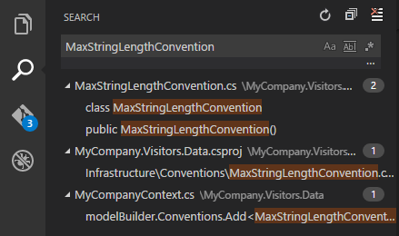
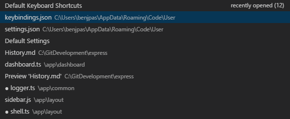
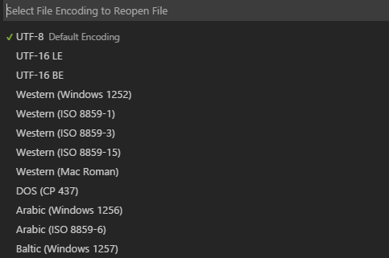

# Visual Studio Code 基础

从骨子里来说，Visual Studio Code 是一款代码编辑器. 跟其它的代码编辑器一样, VS Code 吸取了通用的用户接口和布局：左侧是用于展示所要编辑的所有文件和文件夹的文件管理器，右侧是打开文件的编辑器域。

另外，在VS Code当中还有一些与众不同的特性。在这个主题内将重点描述这些特性。


## 文件（File）, 文件夹（Folders） & 工程（Projects）

VS Code 是基于文件和文件夹的 - 可以在 VS Code中通过打开文件和文件夹立即开始使用.

在这上面，VS Code 可以读取并自用一系列的不同框架和平台定义的工程文件。例如，如果你在VS Code中打开的文件夹中包含一个或多个'package.json'，'project.json'，'tsconfig.json' 亦或者 ASP.net core Visual Studio 解决方案和工程文件，VS Code 将读取这些文件并且利用它们来提供额外的功能，如在编辑器中的丰富的智能感知（IntelliSense）功能。

## 基本布局

VS Code 给我们带来一种简单直观的外观布局，这种布局可以给编辑器提供最大的空间同时又给浏览访问目录或工程上下文提供了充足的空间。整体UI被分成了四个区域：
* **Editor** 用来编辑文件的主体区域。可以并排打开三个编辑器。
* **Side Bar** 包含不同的像浏览器一样的视图来协助来完成工程。
* **Status Bar** 展示当前打开的工程和正在编辑的文件的信息。
* **View Bar** 在最左手边，帮助切换视图以及提供额外的上下文相关的提示，比如激活了Git的情况下，需要提交的变化的数目。

每次打开VS Code的时候，都会回到上一次关闭时的状态。文件夹，布局以及打开的文件都会保存。



除了将文件放在独立的标签页中，VS Code允许一次性打开三个编辑器，可以将最多三个文件并排打开。

这减少了你切换标签页的时间开销，并且不会限制你同时操作的文件数。文件管理器视图含有一个你可以快速打开的文件列表。

>**小技巧：** 你可以将侧边栏移动到右手边(**View** > **Move Sidebar**) 或者将其隐藏(`kb(workbench.action.toggleSidebarVisibility)`).

## 并列编辑

可以最多并排打开三个编辑器.

如果你已经打开一个编辑器，有多种方式可以在旁边打开另一个编辑器：

* 按住`kbstyle(Ctrl)` (Mac: `kbstyle('Cmd')`) 单击文件管理器中的文件
* 使用`kb(workbench.action.splitEditor)`命令来将编辑器拆分为两块
* 在文件管理器中文件右键菜单中单击**Open to the Side** 


任何时候你打开另一个文件，将会显示在当前激活的编辑器中，所以如果你有两个并列编辑器，而你想在右边的编辑器中打开文件"foo.cs"，则打开文件之前必须确保右边的编辑器激活（通过单击编辑器）。

当你打开多个编辑器时，你可以通过按住`kbstyle(Ctrl)` (Mac: `kbstyle('Cmd')`)键并按下`kbstyle(1)`, `kbstyle(2)`或`kbstyle(3)`键来切换编辑器。

>**小技巧：** 你可以通过在编辑器标题区拖拽来对编辑器进行排序和调整大小。

## 文件管理器（Explorer）

文件管理器用来浏览、打开和管理项目内的所有文件和文件夹。

在VS Code中打开文件夹后，文件夹内的内容会显示在文件管理器中，可在此做如下操作：

* 创建、删除、重命名文件和文件夹
* 通过拖拽移动文件和文件夹
* 使用右键菜单操作文件

>**小技巧：** 你可以从VS Code之外拖拽文件到文件管理器来拷贝文件到当前文件夹。


VS Code可以与你是用的其他工具协同工作，特别是命令行工具。如果你想要在当前VS Code中打开文件夹的右键菜单中打开命令行工具，在文件夹上右键选择**Open in Command Prompt** (在OS X或者Linux上选择 **Open in Terminal**)。

也可以在本地资源管理器中找到文件或文件夹，右键并选择**Reveal in Explorer** (在Mac上选择 **Reveal in Finder**或者在Linux上**Open Containing Folder**)。

>**小技巧：** 输入命令 `kb(workbench.action.quickOpen)` (**Quick Open**) 来根据名称快速搜索并打开文件。

默认情况下，VS Code文件管理器中包括所有文件夹(如 `.git`)，我们可以通过`files.exclude` [setting](/docs/customization/userandworkspace.md)文件配置不显示文件和文件夹的规则。

**小技巧：** 这用于隐藏生成的文件非常有用，如Unity的`\*.meta`文件、TypeScript项目的`\*.js`文件。对于Unity，不显示`\*.cs.meta`文件的选择模式应该是：`"**/*.cs.meta": true`，对于TypeScript，不显示TypeScript文件生成的JavaScript文件的选择模式是：`"**/*.js": {"when": "$(basename).ts"}`。

## 打开的编辑器

在文件管理器顶部有一个标签是**WORKING FILES**的部分，这是当前激活文件的列表。这些文件是你之前操作时在VS Code中打开的文件，当做了如下操作时文件会被加入打开编辑器列表：

* 对文件做出更改
* 在文件管理器中双击文件
* 打开一个不在当前文件夹中的文件



可以把**WORKING FILES**列表当做其他编辑器或IDE中的标签页，只要在打开的文件列表中单击文件就可以在VS Code中激活文件，显示在编辑器中。

一旦你完成了任务，你可以单独从打开文件列表中移除文件，或者你可以使用**Close All Files** 操作从打开文件列表中移除所有文件。

>**小技巧：** 你可以输入命令 `kb(workbench.files.action.workingFilesPicker)` 来从文件选择器中选择当前打开文件列表中的文件，而不用去打开文件管理资源器。

## 配置编辑器

VS Code有很多选项可以来配置编辑器，你可以通过用户设置来设置全局选项，或在工作空间设置中针对每个文件夹或项目设置，选项设置保存在`settings.json` [文件](/docs/customization/userandworkspace.md#settings-file-locations)中。
 
* 选择 **Files** > **Preferences** > **User Settings** (或者按下 `kb(workbench.action.showCommands)`, 输入 `user` 然后按下 `Enter`) 来编辑 settings.json 文件.
 
* 选择 **Files** > **Preferences** > **Workspace Settings** (或者按下 `kb(workbench.action.showCommands)`, 输入 `worksp` 然后按下 `Enter`) 来编辑工作空间的 settings.json 文件.

你会看到VS Code [默认配置](/docs/customization/userandworkspace.md#default-settings)在左侧窗口并且你编辑的 `settings.json` 在右侧。你可以只是从默认设置查看和拷贝设置。

在完成设置编辑之后，输入 `kb(workbench.action.files.save)` 来保存更改，更改会立即生效。

## 保存/自动保存

VS Code默认需要一个显示的操作来保存更改到银盘上： `kb(workbench.action.files.save)`。

不过，`自动保存`功能会在配置的延迟时间后或焦点离开编辑器时，保存更改，打开了这个选项之后就没有必要显示保存文件了。

要想配置`自动保存`功能，打开 **User Settings** 或者 **Workspace Settings** 并找到相关设置:

* `files.autoSave`: 自动保存值设置为`off`来禁用此功能，设置为`afterDelay`在配置的延迟时间后保存，设置为`onFocusChange`在鼠标离开已修改文件的编辑器时保存。
* `files.autoSaveDelay`: 设置延迟时间，毫秒为单位，`files.autoSave` 设置为 `afterDelay`时有效。

## 跨文件查找

VS Code允许你在当前打开文件夹中所有文件里面快速搜索，只要输入`kb(workbench.view.search)`然后输入要搜索的内容，搜索结果将会被按照文件分组显示，文件下显示搜索结果部分和在文件中显示的位置，展开一个文件可以预览该文件中所有的搜索结果，然后单击搜索结果便可以在编辑器中显示。



>**小技巧：** 在搜索框中搜索也支持正则表达式。

你可以通过输入`kb(workbench.action.search.toggleQueryDetails)`来配置搜索的高级配置，这样会在查询框显示额外的查询配置项。


在查询框下面的两个输入框，你可以选择包含和排除的文件。单击右侧图标来启用glob匹配模式语法：

* `*` 匹配路径段中的一个或多个字符
* `?` 匹配路径段中的一个字符
* `**` 匹配任意数量的路径段，包括空
* `{}` 匹配分组条件（如： `{**/*.html,**/*.txt}` 匹配所有HTML和txt文件）
* `[]` 声明匹配一个范围内的所有字符（如：`example.[0-9]`匹配 `example.0`, `example.1`, …）

VS Code 默认会排除一些你不会感兴趣的文件夹（如： `node_modules`）来减少查询结果的数量，在设置文件中的`files.exclude` 和 `search.exclude`小节下可以修改这个规则。

>**小技巧：** 可以在文件管理器中右键一个文件夹并选择 **Find in Folder** 来仅在选择文件夹下搜索。

## 命令面板（Command Palette）

VS Code可以同样简单的使用键盘操作，需要了解的最重要的组合键便是`kb(workbench.action.showCommands)`，它可以显示出命令面板，在这里可以获取到VS Code的所有功能，包括最常用的键盘快捷键。


命令面板提供了许多的命令，你可以使用同一交互窗口执行编辑器命令、打开文件、查询字符或者查看文件大纲，如下一些常用操作：

* `kb(workbench.action.quickOpen)` 通过键入文件或符号来导航至相应的位置
* `kb(workbench.action.openPreviousEditor)` 在最近打开文件列表之间切换
* `kb(workbench.action.showCommands)` 直接跳转到编辑器命令面板
* `kb(workbench.action.gotoSymbol)` 导航至文件中的某一指定符号处
* `kb(workbench.action.gotoLine)` 导航至文件中的某一指定行

在输入框中输入`?`获取一个可以执行命令的列表：


## 快速文件导航

The Explorer is great for navigating between files when you are exploring a project. However, when you are working on a task, you will find yourself quickly jumping between the same set of files. VS Code provides two powerful commands to navigate in and across files with easy-to-use key bindings.

Hold `kbstyle(Ctrl)` and press `kbstyle(Tab)` to view a list of all files that have been opened since VS Code was launched. To open one of these files, use `kbstyle(Tab)` again to pick the file you want to navigate to, then release `kbstyle(Ctrl)` to open it.



Alternatively, you can use `kb(workbench.action.navigateBack)` and `kb(workbench.action.navigateForward)` to navigate between files and edit locations. If you are jumping around between different lines of the same file, these shortcuts allow you to navigate between those locations easily.

>**小技巧:** You can open any file by its name when you type `kb(workbench.action.quickOpen)` (**Quick Open**).

## 文件编码支持

Set the file encoding globally or per workspace by using the `files.encoding` setting in **User Settings** or **Workspace Settings**.


You can view the file encoding in the status bar.


Click on the encoding in the status bar to reopen or save the active file with a different encoding.


Then choose an encoding.



## Launching from the Command Line

You can launch VS Code from the command line to quickly open a file, folder, or project. Typically, you open VS Code within the context of a folder. We find the best way to do this is to simply type:

```
code .
```

>**小技巧：** We have instructions for Mac users in our [Setup](/docs/editor/setup.md#_mac-os-x) topic that enable you to start VS Code from within a terminal.  We add the VS Code executable to the `PATH` environment variable in Windows and Linux automatically.

Sometimes you will want to open or create a file. If a file does not exist, we will create it for you:

```
code index.html style.css readme.md
```

>**小技巧：** 可以通过空格来区分多个文件名。


## 额外的命令行参数

在命令行中通过'code'来启动VS Code的时候有一些额外的命令行参数：

参数|描述
------------------|-----------
`-h` or `--help` | 打印说明
`-v` or `--version` | 打印 VS Code 版本 (例如 0.10.10)
`-n` or `--new-window`| Opens a new session of VS Code instead of restoring the previous session.
`-r` or `--reuse-window` | Forces opening a file or folder in the last active window.
`-g` or `--goto` | When used with *file:line:column?*, opens a file at a specific line and optional column position. This argument is provided since some operating systems permit `:` in a file name.
*file* | Name of a file to open. If the file doesn't exist, it will be created and marked as edited. You can specify multiple files by separating each file name with a space.
*file:line:column?* | Name of a file to open at the specified line and optional column position. You can specify multiple files in this manner, but you must use the `-g` argument (once) before using the *file:line:column?* specifier.
*folder* | Name of a folder to open. You can specify multiple folders.
`-d` or `--diff` | Open a file difference editor. Requires two file paths as arguments.
`--locale` | Set the display language (locale) for the VS Code session.  Supported locales are: `en-US`, `zh-TW`, `zh-CN`, `fr`, `de`, `it`, `ja`, `ko`, `ru`, `es` 
`--disable-extensions` | Disable all installed extensions. Extensions will still be visible in the `Extensions: Show Installed Extensions` dropdown but they will never be activated.
`-w` or `--wait` | Wait for the window to be closed before returning

For both files and folders, you can use absolute or relative paths. Relative paths are relative to the current directory of the command prompt where you run `code`.

If you specify more than one file or folder at the command line, VS Code will open only a single instance.

## 打开工程

VS Code does not distinguish between opening a folder and opening a project. If VS Code detects a project in the folder you opened (for example, a C# project), that project context will be displayed on the Status Bar. If more than one project is found, you can switch projects from there as well.

To open a project contained in the folder `C:\src\WebApp`, you would start VS Code like this:

````
code C:\src\webapp
````

After VS Code opens, just open source files and use the Status Bar to switch the active project as needed.


## 管口管理

VS Code has some options to control how windows should be opened or restored between sessions.

The `window.openFilesInNewWindow` setting controls if files should open in a new window instead of reusing an existing VS Code instance. By default, VS Code will open a new window when you double-click on a file outside VS Code or open a file from the command line. Set this to `false` to reuse the last active instance of VS Code and open files in there.

The `window.reopenFolders` setting tells VS Code how to restore the opened windows of your previous session. By default, VS Code will
reopen the last opened folder you worked on (setting: `one`). Change this setting to `none` to never reopen any folders and always start with an empty VS Code instance. Change it to `all` to restore all folders you worked on during your previous session.

## 下一步

You've covered the basic user interface - there is a lot more to VS Code.  Read on to find out about:

* [User/Workspace Settings](/docs/customization/userandworkspace.md) - Learn how to configure VS Code to your preferences through user and workspace settings.
* [Editing Evolved](/docs/editor/editingevolved.md) - Lint, IntelliSense, Lightbulbs, Peek and Goto Definition, and more
* [Debugging](/docs/editor/debugging.md) - This is where VS Code really shines
* [Customization](/docs/customization/overview.md) - Themes, settings, and keyboard bindings

## 常见问题

**Q: Is it possible to globally search and replace?**

**A:** This feature is not yet implemented, but you can expect it to come in the future!

**Q: How do I turn on word wrap?**

**A:** You can control word wrap through the `editor.wrappingColumn` [setting](/docs/customization/userandworkspace.md).  By default `editor.wrapperingColumn` is set to 300 characters.  You can adjust the column width or set the value to zero to wrap on the editor viewport width:

```json
    "editor.wrappingColumn": 0
```

You can toggle word wrap for the VS Code session with `kb(editor.action.toggleWordWrap)`.  Restarting VS Code will pick up the persisted `editor.wrappingColumn` value.

You can also add vertical column rulers to the editor with the `editor.rulers` setting which takes an array of column character positions where you'd like vertical rulers.

**Q: How can I show more files in the WORKING FILES section?**

**A:** You can configure the appearance of **WORKING FILES** through your [settings](/docs/customization/userandworkspace.md). For example, you can set the maximum number of visible files before a scroll bar appears via the `explorer.workingFiles.maxVisible` setting and whether the **WORKING FILES** section should dynamically set its height via `explorer.workingFiles.dynamicHeight`.
