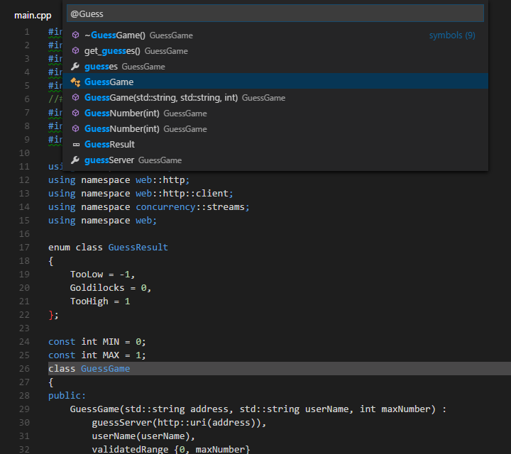
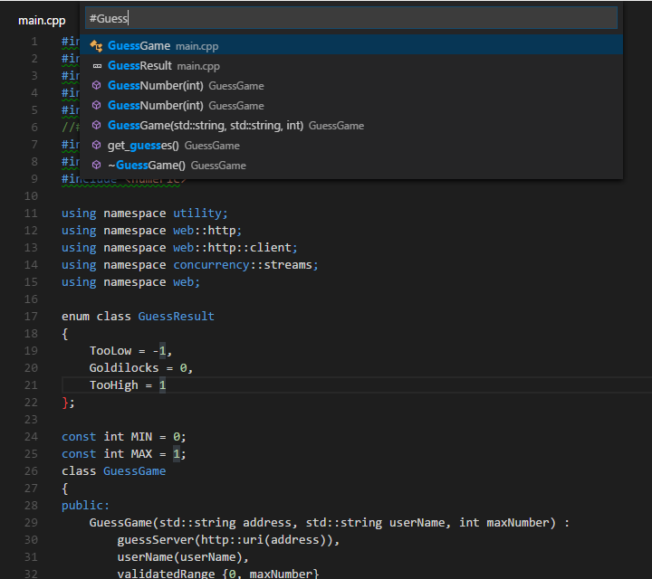
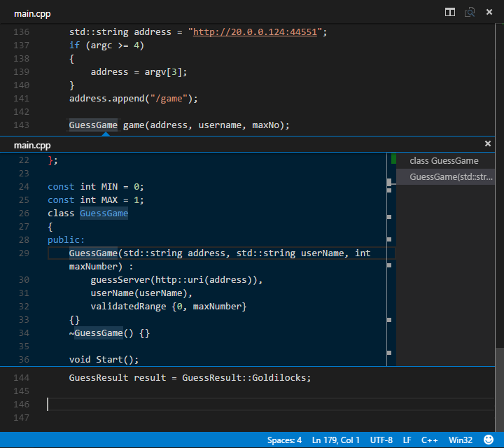
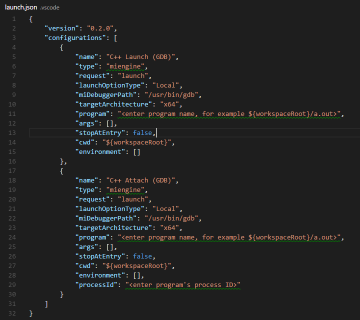

# C/C++ for VS Code (Preview)

C/C++ support for Visual Studio Code is provided today as a preview of our work to enable cross-platform C and C++ development using VS Code on Windows, Linux, and OS X. Our focus in this preview release is code editing and navigation support for C and C++ code everywhere that VS Code runs, as well as debugging on Linux (Ubuntu 14.04 64-bit) and OS X (see _Known limitations_ below).

If you just want a lightweight tool to edit your C++ files VS Code has you covered wherever you are, but if you want the best possible experience for your existing Visual C++ projects or debugging on Windows, we recommend you use a version of Visual Studio such as [Visual Studio Community](https://www.visualstudio.com/products/visual-studio-community-vs).

Because we're still shaping the C++ experience in VS Code, now is a great time to [provide bug reports, feature requests, and feedback](mailto:c_cpp_support@microsoft.com), and for those of you who use Linux or OS X as your development environment to [get engaged](http://landinghub.visualstudio.com/c-nonwin) with the Visual Studio team.

## Installing C++ support

C++ language support is an optional [install from the Marketplace](https://marketplace.visualstudio.com/items?itemName=ms-vscode.cpptools). Or, just install it from VS Code by launching the __Quick Open__ (`kb(workbench.action.quickOpen)`) and then entering the command **ext install cpptools**.

On Linux, there's an additional step that installs dependencies necessary for debugging support. When VS Code restarts after installing the extension, a script installs the [dotnet cli](http://dotnet.github.io/) dependency. Because elevated permissions are needed to install this package, you'll be prompted for your password in the terminal where the script is running. If you'd rather perform these last steps yourself, you can close the terminal now, then enter the commands yourself (these steps must be completed to enable debugging support.) For more information on these commands, see _Manual Installation for the C++ Debugger extension_ in the [README](https://marketplace.visualstudio.com/items?itemName=ms-vscode.cpptools).

On OS X, additional install steps need to be completed manually to enable debugging on OS X. See _Manual Installation for the C++ Debugger extension_ in the [README](https://marketplace.visualstudio.com/items?itemName=ms-vscode.cpptools).

## Navigating code

### Search for Symbols

You can search for symbols in the current file or workspace to navigate your code more quickly.

To search for a symbol in the current file, press `kb(workbench.action.gotoSymbol)`, then enter the name of the symbol you're looking for. A list of potential matches will appear and be filtered as you type. Choose from the list of matches to navigate to its location.



To search for a symbol in the current workspace, start by pressing `kb(workbench.action.showAllSymbols)` instead, then enter the name of the symbol. A list of potential matches will appear as before. If you choose a match that was found in a file that's not already open, the file will be opened before navigating to the match's location.



Alternatively, you can search for symbols by accessing these commands through the __Command Palette__ if you prefer. Use __Quick Open__ (`kb(workbench.action.quickOpen)`) then enter the '@' command to search the current file, or the '#' command to search the current workspace. `kb(workbench.action.gotoSymbol)` and `kb(workbench.action.showAllSymbols)` are just shortcuts for the '@' and '#' commands, respectively, so everything works the same.

### Peek Definition

You can take a quick look at how a symbol was defined by using the Peek Definition feature. This feature displays a few lines of code near the definition inside a peek window so you can take a look without navigating away from your current location.

To peek at a symbol's definition, place your cursor on the symbol anywhere its used in your code and then press `kb(editor.action.previewDeclaration)`. Alternatively, you can choose __Peek Definition__ from the context menu (right-click, then choose __Peek Definition__). 



Currently, the C/C++ extension doesn't parse code in a way that helps it distinguish between competing definitions based on how the symbol is used. These competing definitions arise when the symbol defines different things in different contexts, such as occurs with overloaded functions, classes and their constructors, and other situations. When this happens, each of the competing definitions are listed in the right-hand side of the peek window with the source code of the current selection displayed on the left.

With the peek window open, you browse the list of competing definitions to find the one you're interested in. If you want to navigate to the location of one of the definitions just double-click the definition you're interested in, or by double-clicking anywhere in the source code displayed on the left-hand side of the peek window. 

### Go to Definition

You can also quickly navigate to where a symbol is defined by using the Go to Definition feature.

To go to a symbol's definition, place your cursor on the symbol anywhere its used in your code and then press `kb(editor.action.goToDeclaration)`. Alternatively, you can choose __Go to Definition__ from the context menu (right-click, then choose __Go to Definition__). When there's only one definition of the symbol, you'll navigate directly to its location, otherwise the competing definitions are displayed in a peek window as described in the previous section and you have to choose the definition that you want to go to.

## Debugging

Debugging is supported on Linux (Ubuntu 14.04 64-bit) and OS X (see Known limitation below).

### Preparing your launch.json file for debugging

Before you can debug your app you'll need to set a few things up. Navigate to the Debug View (click the debug icon in the toolbar on the left-hand side of the VS Code window) then in the __Debug Panel__, click the __Settings__ icon and select `C++ Launch (GDB)`. This opens the ```launch.json``` file for editing.



This file, ```launch.json```, contains configurations that tell the debugger how to interact with your app. Two configurations are included by default -- one that defines the properties for launching your app under GDB from VS Code, and another that defines the properties for attaching GDB to a process that's already running. Note that launching your app under GDB is not currently supported on OS X, for now you have to use Attach to debug OS X apps.

At the minimum, you'll need to update the 'program' property to contain the program name and path, but you can modify other properties as well. You can view a tooltip that describes each property and its possible values by placing your cursor over a property. For more information about the properties inside the launch.json file and how to use them, see the VS Code [debugging documentation](/docs/editor/debugging.md).

After your launch.json file is configured you're ready to start debugging, but remember that VS Code won't rebuild your program when you make changes to it between debugging sessions unless you also create a task.json file to invoke the build and set it as the preLaunchTask property in the launch.json file

### Conditional Breakpoints

Conditional breakpoints enable you to break execution on a particular line of code only when the value of the conditional is true. To set a conditional breakpoint, right-click on an existing breakpoint and select __Edit Breakpoint__, this opens a small peek window where you can enter the condition that must evaluate to true in order for the breakpoint to activate and break execution.


In the editor, conditional breakpoints are indicated by a breakpoint symbol that has a black equals sigh inside of it. You can place the cursor over a conditional breakpoint to show its condition.

### Function Breakpoints

Function breakpoints enable you to break execution at the beginning of a function rather than on a particular line of code. To set a function breakpoint, on the __Debug Panel__, right click inside the __Breakpoints__ pane, then choose __Add Function Breakpoint__ and enter the name of the function on which you want to break execution.

### Expression evaluation

VS Code supports expression evaluation in several contexts:

* You can type an expression into the __Watch__ pane and it will be evaluated each time a breakpoint is hit.
* You can type an expression into the __Debug Console__ and it will be evaluated only once.
* You can evaluate any expression that appears in your code while you're stopped at a breakpoint.

Note that expressions in the Watch Pane take effect in the application being debugged; an expression that modifies the value of a variable will modify that variable for the duration of the program.

### Core Dump debugging

The C/C++ extension for VS Code also has the ability to debug using a memory dump. To debug using a memory dump, open your launch.json file for editing and add the `coreDumpPath` property to the __C++ Launch__ configuration, setting its value to be a string containing the path to the core dump. This will even work for multi-threaded programs and x86 programs being debugged on an x64 machine.

### GDB and MI commands

You can execute GDB or MI commands directly through the debug console with the `-exec` command, but be careful -- executing GDB commands directly in the debug console is untested and might crash VS Code in some cases. For more information on debugging with VS Code, see this introduction to [debugging in VS Code](/docs/editor/debugging.md).

### Other Debugging Features
* Unconditional breakpoints
* Watch window
* Call stack
* Stepping

## Known limitations

### Symbols and Code Navigation

All platforms:

* Because the extension doesn't parse function bodies, Peek Definition and Go to Definition don't work for symbols defined inside the body of a function. 

### Debugging

Windows:

* Debugging is not currently supported on Windows.

Linux:

* Ubuntu 14.04 64-bit is the only version of Linux supported by the script that performs additional install steps on Linux. Other versions of Linux might work if you perform these steps manually, but you might need to modify them for your version of Linux. For more information on these steps, see _Manual Installation for the C++ Debugger extension_ in the [README](https://marketplace.visualstudio.com/items?itemName=ms-vscode.cpptools).
* GDB needs elevated permissions in order to attach to a process. When using *attach to process*, you need to provide your password before the debugging session can begin. 

OS X:

* Additional install steps need to be completed manually to enable debugging on OS X. See _Manual Installation for the C++ Debugger extension_ in the [README](https://marketplace.visualstudio.com/items?itemName=ms-vscode.cpptools).
* *Launch process* is not currently supported on OS X.
* No additional terminal is provided for programs that already display a terminal, and the GDB shell is not available for those applications.

## Next Steps

Read on to find out about:

* [Editing Evolved](/docs/editor/editingevolved.md) - find out more about advanced editing features
* [Tasks](/docs/editor/tasks.md) - use tasks to build your project and more
* [Debugging](/docs/editor/debugging.md) - find out how to use the debugger with your project

## Common Questions

**Q: Which versions of Linux support debugging?**

**A:** In this release our Linux install script targets Ubuntu 14.04 64-bit, therefore its the only version of Linux that officially supports debugging. Other versions of Linux might work if you perform the steps found in the script, but you might need to modify them for your version of Linux. For more information on these steps, see _Manual Installation for the C++ Debugger extension_ in the [README](https://marketplace.visualstudio.com/items?itemName=ms-vscode.cpptools).

**Q: Why do I need provide my password to complete installation of the extension on Linux?**

**A:** VS Code takes a dependency on [dotnet cli](http://dotnet.github.io/) to enable debugging support on Linux. Root access is required to install the dotnet cli package. Normally these steps are performed by a script we've provided, but you can perform the steps manually if you prefer not to run the script with elevated permissions. 

**Q: My project won't load.**

**A:** VS Code doesn't currently support C++ project files, instead it considers a directory of your choosing to be the workspace of your project. Source code files inside that directory and its sub-directories are part of the workspace.

**Q: IntelliSense isn't working.**

**A:** In this release, IntelliSense isn't supported. We plan to enable this and other features in future releases.

**Q: How do I build/run my project?**

**A:** VS Code supports tasks that you can configure to build your application, and natively understands the output of MSBuild, CSC, and XBuild. For more information, see the [Tasks](/docs/editor/tasks.md) documentation.

